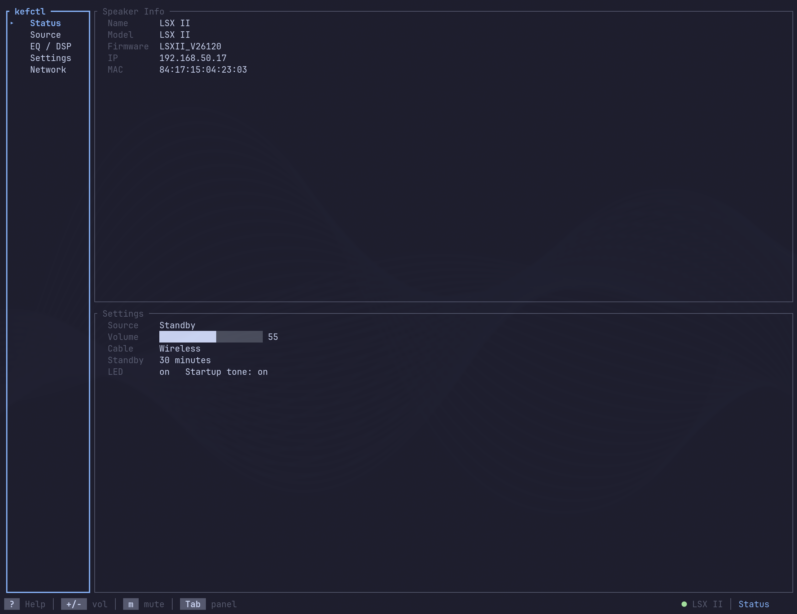
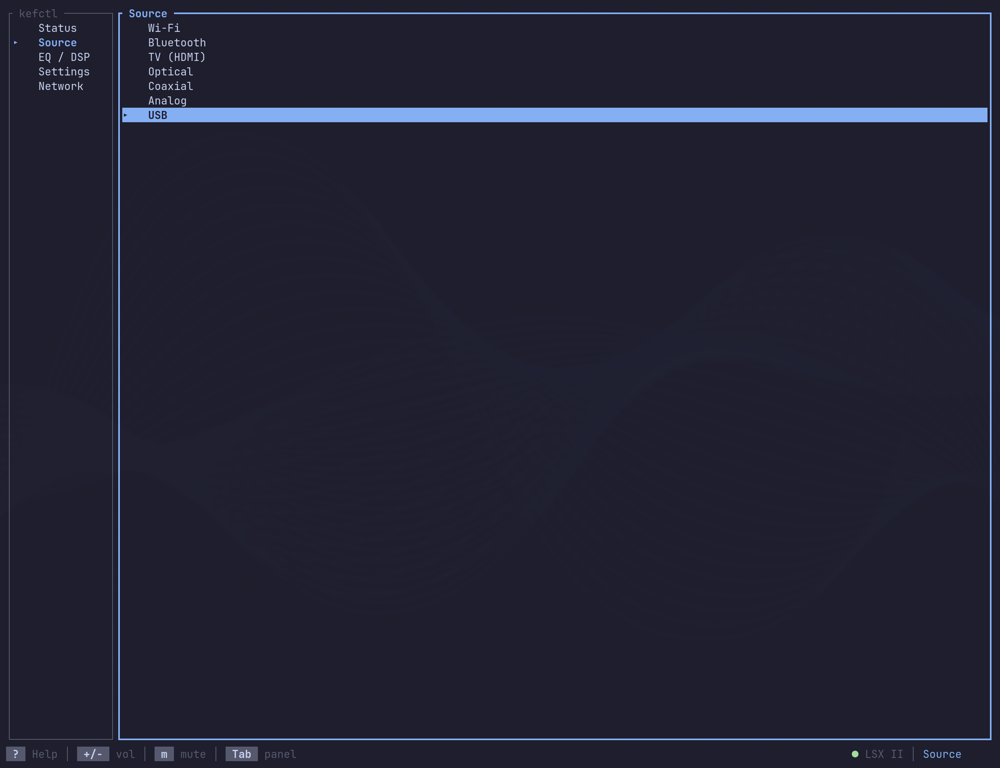
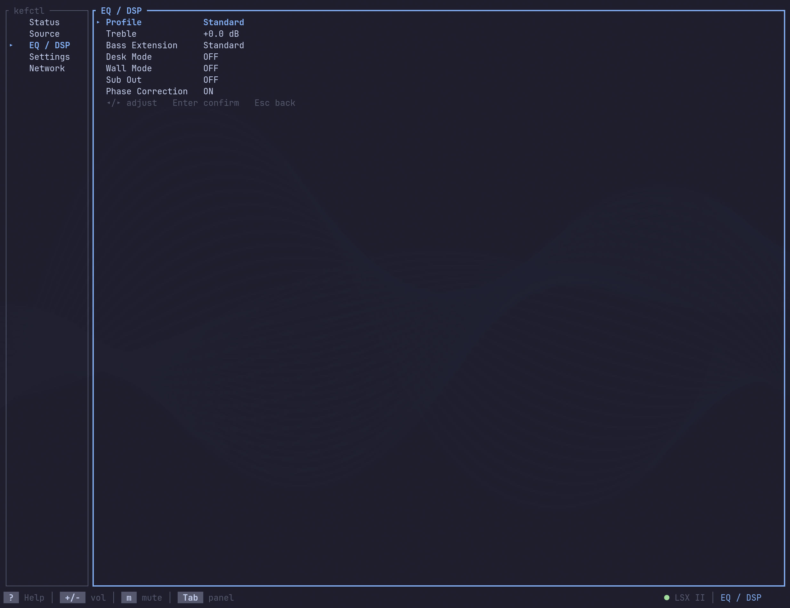
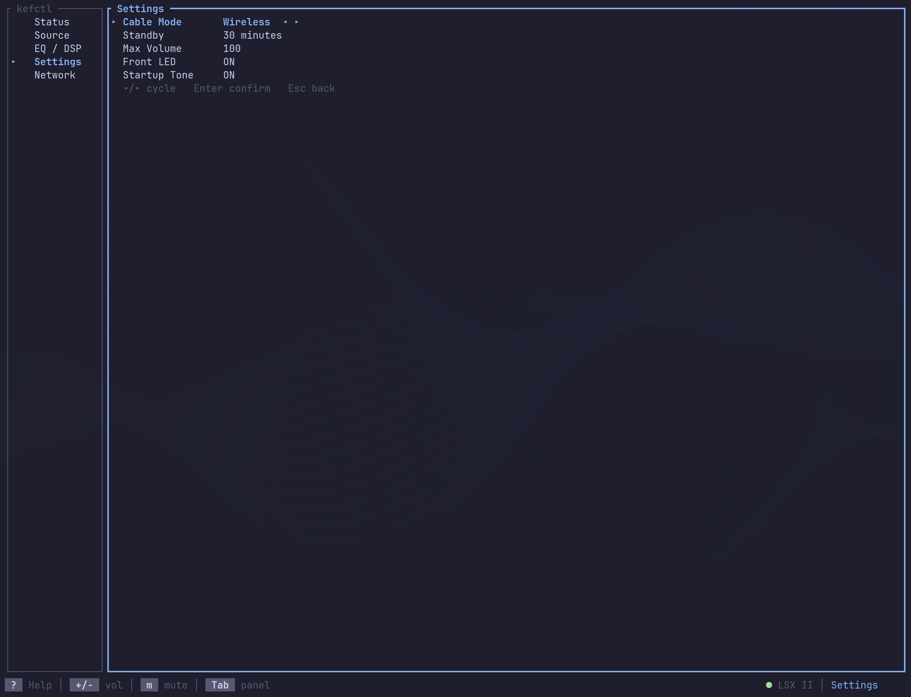
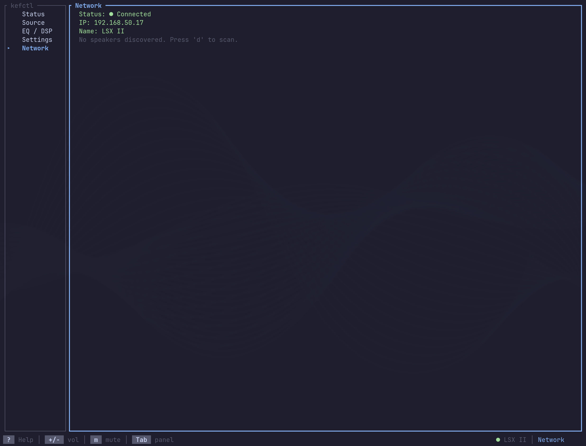

# kefctl

TUI controller for KEF W2-platform speakers (LSX II, LS50 Wireless II, LS60 Wireless).



Keyboard-driven terminal interface that talks to KEF speakers over their HTTP JSON API. Auto-discovers speakers via mDNS, provides real-time status updates, and supports scriptable CLI commands.

## Install

```sh
# Arch Linux (AUR)
yay -S kefctl

# From source
cargo install --path .
```

Or build a release binary:

```sh
cargo build --release
cp target/release/kefctl ~/.bin/
```

## Usage

```sh
# Launch TUI (auto-discovers speaker)
kefctl

# Connect to a specific speaker
kefctl --speaker 192.168.50.17

# Demo mode (no speaker needed)
kefctl --demo

# CLI commands (scriptable)
kefctl discover              # Find speakers on the network
kefctl status                # Print speaker status
kefctl source                # Show current source
kefctl source wifi           # Switch source
kefctl volume                # Show current volume
kefctl volume 30             # Set volume
kefctl mute                  # Toggle mute
kefctl mute on               # Mute
kefctl mute off              # Unmute
kefctl toggle                # Wake or standby the speaker
kefctl waybar                # JSON status for waybar module
kefctl ip                    # Print the resolved speaker IP address
```

## TUI Keybindings

Press `?` in the app for the full keybindings overlay.

| Key | Action |
|-----|--------|
| `q` / `Ctrl+c` | Quit |
| `?` | Help overlay |
| `Tab` / `Shift+Tab` | Next/prev panel |
| `j` / `k` | Move down/up |
| `h` / `l` | Focus sidebar/main panel |
| `Enter` | Select/confirm |
| `Esc` | Back to sidebar |
| `+` / `-` | Volume up/down |
| `m` | Toggle mute |
| `←` / `→` | Adjust value (EQ/Settings panels) |

## Panels

**Status** — Speaker info, settings summary. Press `e` to rename the speaker inline.


**Source** — Select input source (Wi-Fi, Bluetooth, USB, TV, Optical, Coaxial, Analog)



**EQ / DSP** — Treble, bass extension, desk/wall mode, subwoofer settings, phase correction, balance. All rows adjustable with Left/Right.



**Settings** — Standby timeout, max volume, front LED, startup tone, cable mode, wake-up source, app analytics. All rows adjustable with Left/Right.



**Network** — Connection status, discovered speakers on the network



## Architecture

See [docs/architecture.md](docs/architecture.md) for the full module map and data flow.

```
.github/
└── workflows/
    ├── ci.yml           # GitHub Actions CI (clippy, test, release build, audit, deny)
    └── aur-publish.yml  # Auto-publish to AUR on version tags
aur/
└── PKGBUILD             # Arch Linux package definition
src/
├── main.rs          # CLI parsing, TUI loop, action dispatch
├── app.rs           # App state, keyboard handling, Panel/Focus enums
├── cli.rs           # CLI argument parsing (clap derive)
├── event.rs         # Async event loop: terminal, speaker polling, SIGUSR1
├── tui.rs           # Terminal init/restore
├── config.rs        # ~/.config/kefctl/config.toml loader
├── discovery.rs     # mDNS speaker discovery via _kef-info._tcp
├── error.rs         # KefError enum
├── kef_api/         # HTTP API client
│   ├── mod.rs       # KefClient, get_data/set_data, fetch_full_state
│   ├── types.rs     # ApiValue tagged union, Source, StandbyMode, EqProfile
│   ├── volume.rs    # Volume get/set
│   ├── source.rs    # Source get/set
│   ├── settings.rs  # Cable mode, standby, LED, startup tone
│   ├── paths.rs     # API path constants
│   └── events.rs    # Event subscribe/poll/unsubscribe
└── ui/              # Ratatui rendering
    ├── mod.rs       # Layout, footer, notification overlay
    ├── theme.rs     # Theme struct, Omarchy loader, SIGUSR1 reload
    ├── sidebar.rs   # Panel navigation list
    ├── status.rs    # Speaker info + settings summary
    ├── source.rs    # Source selector list
    ├── eq.rs        # EQ parameter editor
    ├── settings.rs  # Settings editor
    ├── network.rs   # Connection status + discovered speakers
    └── help.rs      # Keybindings overlay
```

## Configuration

Optional config at `~/.config/kefctl/config.toml`:

```toml
[speaker]
ip = "192.168.50.17"
name = "Living Room"
default_source = "usb"   # fallback for toggle (usb, wifi, bluetooth, tv, optical, coaxial, analog)

[ui]
refresh_ms = 1000
```

## Speaker Resolution

The speaker IP is resolved in this order:

1. `--speaker <ip>` flag
2. `speaker.ip` in config file
3. Cached IP from last successful connection (`~/.local/state/kefctl/last_speaker`)
4. mDNS discovery (`_kef-info._tcp.local.`) — uses first KEF speaker found

After a successful connection, the speaker IP is cached so subsequent launches skip the 5-second mDNS discovery.

## Themes

kefctl integrates with [Omarchy](https://github.com/basecamp/omarchy) for live theme switching. When Omarchy is installed, colors are read from `~/.config/omarchy/current/theme/colors.toml` at startup. Without Omarchy, a built-in default theme is used.

### Live reload

Send `SIGUSR1` to reload the theme without restarting:

```sh
pkill -USR1 kefctl
```

To auto-reload when Omarchy changes themes, add a hook:

```sh
mkdir -p ~/.config/omarchy/hooks/theme-set.d
cat > ~/.config/omarchy/hooks/theme-set.d/kefctl << 'EOF'
#!/bin/bash
pkill -USR1 kefctl 2>/dev/null || true
EOF
chmod +x ~/.config/omarchy/hooks/theme-set.d/kefctl
```

### Color mapping

| Omarchy key | Theme fields |
|-------------|-------------|
| `accent` | Focused borders, highlights |
| `foreground` | Primary text |
| `color1` | Error/disconnected status |
| `color2` | OK/connected status |
| `color3` | Warnings, keybinding labels |
| `color8` | Dim text, unfocused borders, badge backgrounds |

## Waybar Integration

kefctl can drive a waybar custom module for one-click speaker control.

### CLI commands

```sh
kefctl toggle    # Wake speaker to last-used source, or send to standby
kefctl waybar    # Output JSON status for waybar custom module
```

`toggle` remembers the last-used source (persisted to `~/.local/state/kefctl/last_source`). On first use or when no source is saved, it falls back to the `default_source` config option, then USB.

```toml
# ~/.config/kefctl/config.toml
[speaker]
default_source = "usb"   # fallback for toggle (usb, wifi, bluetooth, tv, optical, coaxial, analog)
```

### Waybar config

Add to `~/.config/waybar/config`:

```json
"custom/kef": {
    "exec": "kefctl waybar",
    "return-type": "json",
    "interval": 30,
    "signal": 8,
    "on-click": "kefctl toggle && pkill -RTMIN+8 waybar",
    "on-click-right": "sh -c 'if command -v ghostty >/dev/null 2>&1; then ghostty -e kefctl; else alacritty -e kefctl; fi' &",
    "format": "{icon}",
    "format-icons": {
        "on": "󰓃",
        "off": "󰓄"
    }
}
```

Add to `~/.config/waybar/style.css`:

```css
#custom-kef.on { color: @accent; }
#custom-kef.off { color: @foreground; opacity: 0.5; }
```

- Left-click toggles the speaker on/off with instant icon refresh via `SIGRTMIN+8`
- Right-click opens the full TUI in ghostty (alacritty fallback)
- Background poll every 30 seconds for passive status updates

## Development

### Prerequisites

- Rust 1.86+ (uses edition 2024)
- A KEF W2-platform speaker on the network (or use `--demo`)

### Quick start

```sh
git clone https://github.com/douglas/kefctl.git
cd kefctl
cargo run -- --demo        # No speaker needed
cargo test                 # Run tests (app state, UI rendering, types, API, errors, config, snapshots)
cargo clippy               # Lint
```

GitHub Actions CI runs `clippy --all-targets -- -D warnings`, `cargo test`, a release build, `cargo audit` for vulnerability scanning, and `cargo deny check` for dependency policy on every push and PR.

### Testing against a real speaker

```sh
cargo run -- discover                     # Find your speaker
cargo run -- --speaker 192.168.50.17      # Connect to it
kefw2 -s 192.168.50.17 info              # Debug with kefw2 CLI
curl -s 'http://192.168.50.17/api/getData?path=settings:/deviceName&roles=value'  # Raw API
```

### Adding a new panel

1. Create `src/ui/mypanel.rs` with `pub fn draw(frame, app, area)`
2. Add variant to `Panel` enum in `app.rs`, update `ALL`, `label()`, `index()`
3. Wire it in `ui/mod.rs` match and `app.rs` keyboard handling
4. Use `theme.block(title, focused)` for borders, `app.theme.*` for colors

### Adding a new API field

1. Add the field to `SpeakerState` in `app.rs`
2. Test the API endpoint: `curl -s 'http://<ip>/api/getData?path=<path>&roles=value'`
3. Add an `ApiValue` variant in `types.rs` if it's a new type
4. Fetch it in `fetch_full_state()` in `kef_api/mod.rs`
5. Display it in the relevant `ui/*.rs` panel

### Learning resources

New to Rust? See [docs/LEVELUP.md](docs/LEVELUP.md) for a guided tour of the technologies used in this project.

## KEF API

kefctl communicates with the speaker's HTTP API on port 80:

- **`GET /api/getData?path=...&roles=value`** — Read state (volume, source, settings)
- **`POST /api/setData`** — Write state (set volume, switch source)
- **`GET|POST /api/event/modifyQueue`** — Subscribe/unsubscribe to state changes
- **`GET|POST /api/event/pollQueue`** — Long-poll for events

Values use a tagged union format: `{"type": "i32_", "i32_": 50}`.

## Logging

Logs are written to `~/.local/state/kefctl/kefctl.log` (no terminal output to keep TUI clean).

## Security

kefctl communicates with KEF speakers over **plaintext HTTP** on the local network. This is a hardware limitation — the speakers do not support HTTPS. All commands and status data are visible to anyone on the same LAN.

**Trust boundary:** Your local network. Do not expose kefctl or the speaker's API port to untrusted networks.

**Hardening measures:**
- `#![forbid(unsafe_code)]` — no unsafe Rust, cannot be overridden per-item
- HTTP redirects disabled — prevents SSRF via spoofed speakers
- HTTP response bodies capped at 64KB before deserialization — guards against memory exhaustion from a rogue device
- Network-sourced strings (speaker names, API data, mDNS names, error bodies) sanitized to strip control characters including DEL (0x7F)
- State files use atomic writes (write-then-rename) to prevent symlink attacks
- State and log files created with `0o600` permissions; state directories with `0o700`
- Cached IPs validated on load as `IpAddr`
- Waybar JSON output uses `serde_json` for proper escaping
- Supply chain: `cargo-audit` and `cargo-deny` run in CI on every push; policy defined in `deny.toml`

## Changelog

See [CHANGELOG.md](CHANGELOG.md) for release history.

## License

MIT
